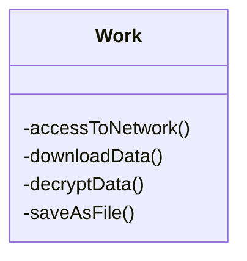
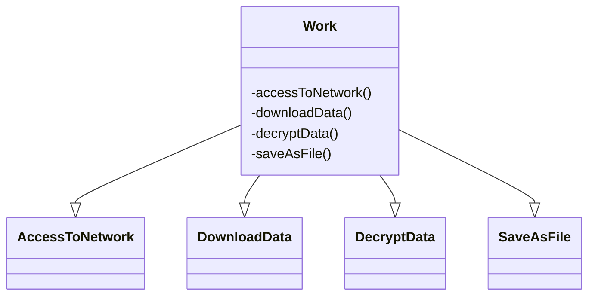
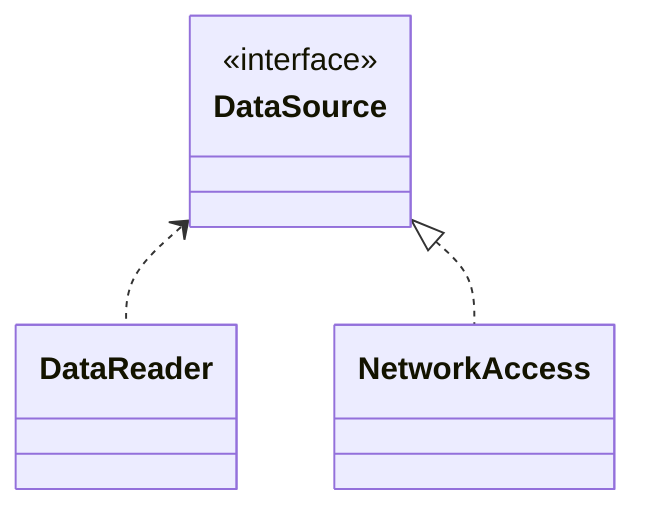
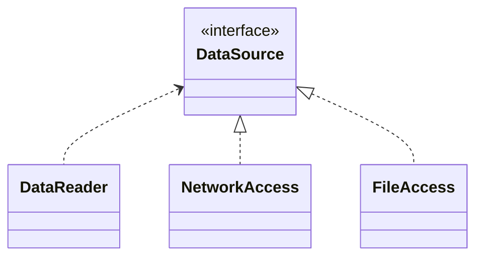
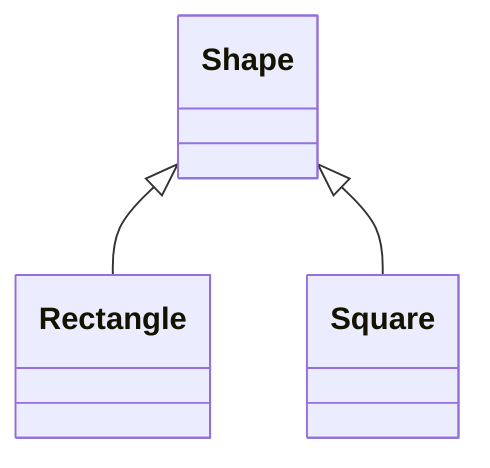
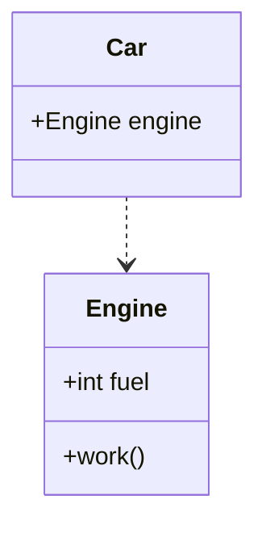
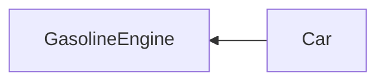
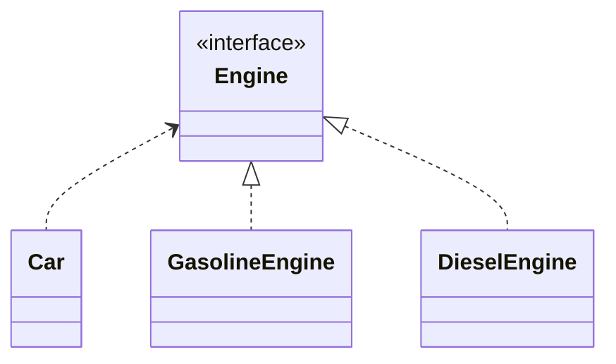
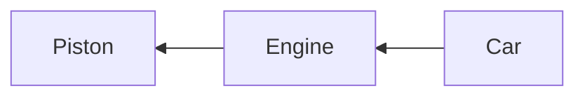
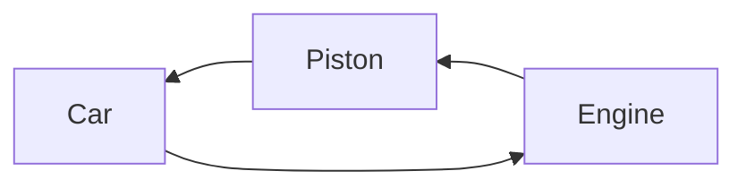

이번 영상에서는 의존성 주입에 대해 알아보도록 하겠습니다.

## SOLID 원칙

의존성 주입은 객체지향 프로그래밍의 개념중 하나인데요, 이것을 이해하기 위해 우선은 객체지향 설계의 5대원칙으로 일컬어지는 SOLID 원칙에 대해 알아볼 필요가 있습니다. [SOLID 원칙](https://en.wikipedia.org/wiki/SOLID)이란 [로버트 마틴](https://en.wikipedia.org/wiki/Robert_C._Martin) 선생이 2000년에 [Design Principles and Design Patterns](https://web.archive.org/web/20150906155800/http://www.objectmentor.com/resources/articles/Principles_and_Patterns.pdf)에서 주창한 객체 지향 프로그래밍 및 설계의 기본 원칙을, Michael Feathers가 두문자어 기억법을 써서 다섯가지로 정리한 것입니다.

### 단일 책임 원칙 (Single responsibility principle, SRP)
> "There should never be more than one reason for a class to change."

단일 책임 원칙이란 클래스가 여러개의 책임을 갖게 되면, 각 책임마다 클래스를 변경할 수 있는 이유가 생기므로 책임을 단 한 개만 가지도록 설계하라는 뜻입니다. 

예를 들면 네트워크에 접속해서, 암호화된 데이터를 다운로드하고, 데이터를 복호화한 뒤, 파일로 저장하는 `Work` 클래스가 있다고 하겠습니다. 네 개의 책임 중 하나만 변경이 되어도 이 클래스는 수정되어야 합니다. 또 이 클래스에 연결된 클래스가 있다면 책임 하나의 기능 변경이 일어나도 연결된 모든 클래스가 그에 맞춰 수정되어야 하지요.



객체가 갖는 책임이 많아질수록 기능 변경은 점점 어려워지게 되므로, 이를테면 `Work`의 책임을 네 개의 클래스로 나누어 기능을 유연하게 변경할 수 있도록 하라는 것이 단일 책임 원칙입니다.



### 개방-폐쇄 원칙 (Open-closed principle, OCP)
> "Software entities ... should be open for extension, but closed for modification."

개방-폐쇄 원칙은 객체를 수정하지 않고도 기능을 확장할 수 있게 설계해야 한다는 뜻입니다. 이게 어떻게 가능할까요?

예를 들어 네트워크에서 데이터를 읽어오는 `DataReader` 클래스가 있다고 하겠습니다. 이 때 네트워크에서 데이터를 다운로드하는 기능은 `NetworkAccess` 클래스로 분리시킵니다. 그리고 `DataSource` 인터페이스를 만들어서 `NetworkAccess`가 `DataSource`를 상속하게 합니다. 



이제 `DataReader`에 네트워크가 아닌 로컬파일에서 데이터를 읽어오는 기능을 추가하고 싶다고 합시다. 그러면 우리는 로컬 파일에서 데이터를 읽어오는 기능을 가진 `FileAccess` 클래스를 만들고 `FileAccess`가 `DataSource` 인터페이스를 상속하게 하면 됩니다. 그러면 `DataReader`는 `DataSource`를 참조하고 있기 때문에 기능을 변경하지 않고도 파일에서 데이터를 읽어오는 기능을 추가할 수 있게 됩니다.



기능을 확장하는 부분은 인터페이스를 사용해 추상화하고, 새로운 기능의 추가에는 상속(다형성)을 적용함으로써 클래스를 유연하게 변경할 수 있게 되는 것입니다.


### 리스코프 치환 원칙 (Liskov substitution principle, LSP)

> "Functions that use pointers or references to base classes must be able to use objects of derived classes without knowing it."

리스코프 치환 원칙에 따르면 상위타입 객체가 하위타입 객체로 변환되어도 상위타입을 사용하는 프로그램은 정상적으로 동작해야 합니다.

잘 알려진 [직사각형-정사각형 문제](https://en.wikipedia.org/wiki/Circle%E2%80%93ellipse_problem)를 예로들어 설명을 해 보겠습니다. 직사각형의 정의는 `네 각이 직각인 사각형`이고, 정사각형은 `네 각이 직각이면서 네 변의 길이가 모두 같은 사각형`입니다.

```kotlin
open class Rectangle {
    open var width = 0
    open var height = 0
    val area: Int
        get() = this.width * this.height
}

class Square : Rectangle() {
    override var width: Int
        get() = super.width
        set(width) {
            super.width = width
            super.height = width
        }
    override var height: Int
        get() = super.height
        set(height) {
            super.width = height
            super.height = height
        }
}
```

다음은 사각형의 면적을 구하는 코드인데요 `Rectangle`을 전달하면 문제없이 `Assertion`이 성공합니다. 그런데 LSP에 따르면 `Rectangle`의 하위타입인 `Square`를 전달해도 면적이 정상적으로 구해져야 하는데 그렇지 않으므로 LSP를 위반하게 됩니다. 

```kotlin
fun calculateArea(r: Rectangle) {
    r.width = 2
    r.height = 3
    assert(r.area == 6)
}

fun main() {
    calculateArea(Rectangle())
    calculateArea(Square())
}
```
이것은 개념적으로는 직사각형과 정사각형이 상속관계처럼 보이더라도 실제 구현은 상속관계가 아니기 때문입니다. 그러므로 여기서는 더 추상화된 `Shape` 객체를 추가로 만들어서 `Rectangle`과 `Square`가 모두 `Shape`를 상속하게 하고 `Shape`의 면적을 계산하는 함수를 만드는 것이 더 적절합니다.



LSP를 위반한다는 것은 하위타입이 상위타입의 명세를 제대로 지키지 않고 있다는 뜻입니다. 만약 상위타입의 코드에서 하위타입을 구분해야 하는 경우, 상위타입으로 치환할 수 없기 때문에 코드 내부에서 `instanceOf` 를 써야 합니다. 그런데 이렇게 하면 하위타입을 새로 만들때마다 상위타입의 코드를 수정해야 하니 결과적으로 OCP도 깨지기 쉬워져서 기능확장이 어려워지게 됩니다.


### 인터페이스 분리 원칙 (Interface segregation principle, ISP)
> "Many client-specific interfaces are better than one general-purpose interface."

이 문장의 뜻은 구현할 필요가 없는 메소드를 가진 인터페이스를 객체에 사용하지 말라는 뜻입니다. 예를 들어 동물을 표현하는 `Animal` 인터페이스가 있다고 하겠습니다.

```kotlin
interface Animal {
    fun eat()
    fun run(from: Where, to: Where)
    fun fly(from: Where, to: Where)
}
```

그리고 `Animal`을 구현하는 `Eagle`과 `Lion` 클래스를 작성합니다.

```kotlin
class Eagle : Animal {
    override fun eat() = println("### walk ###")
    override fun run(from: Where, to: Where) = println("### run ###")
    override fun fly(from: Where, to: Where) = println("### fly ###")
}

class Lion : Animal {
    override fun eat() = println("### walk ###")
    override fun run(from: Where, to: Where) = println("### run ###")
    override fun fly(from: Where, to: Where) // 구현 필요 없음
}
```

`Eagle`은 `Animal`의 모든 기능을 구현해야하므로 사용에 아무런 문제가 없지만, `Lion`은 날지도 못하는데 `Animal`을 상속했기 때문에 의무적으로 `fly`를 구현해야 합니다. 게다가 만약 `fly`의 파라메터나 리턴타입같은 사양이 변경될 경우 `Lion` 클래스는 사용하지도 않는 `fly`를 그에 따라 수정해야 하는 문제가 발생합니다. 

클라이언트의 입장에서 사용하는 기능만 제공하도록 인터페이스를 분리하라는 것이 ISP의 의도이므로, 여기서는 `Animal` 인터페이스를 `Bird`와 `Mammal`로 분리하여 사용하는 것이 적절하겠죠. 

```kotlin
interface Bird {
    fun eat()
    fun run(from: Where, to: Where)
    fun fly(from: Where, to: Where)
}

interface Mammal {
    fun eat()
    fun run(from: Where, to: Where)
}
```

### 의존성 역전 원칙 (Dependency inversion principle, DIP)
> "Depend upon abstractions, [not] concretions."

Dependency, 의존이란 무엇일까요. 객체 A가 객체 B를 생성하거나 객체 B의 메서드를 호출할 때 A는 B에 의존한다, 혹은 A가 의존성 B를 갖는다고 표현합니다. 다음 그림에서는 `Car` 클래스가 `Engine` 클래스에 의존하고 있습니다.



의존성 역전 원칙에 따르면 상위 레벨 모듈이 하위 레벨 모듈에 의존해서는 안 되고 추상화에 의존해야 한다고 정의합니다. 이게 무슨 말일까요?

자동차를 예를 들어 설명해 보겠습니다. 자동차는 상위레벨 모듈이고 자동차를 구성하는 엔진, 타이어, 핸들은 하위레벨 모듈이 됩니다. 이제 가솔린 엔진을 탑재한 `Car` 클래스가 있다고 하겠습니다.

```kotlin
class GasolineEngine {
    val fuel = "gasoline"
}

class Car {
    val engine = GasolineEngine()
}
```

이제 가솔린 엔진을 경유 엔진으로 변경해 보겠습니다. 엔진을 변경하였기 때문에 `Car` 내부의 코드를 다음과 같이 변경하면 되겠죠.

```kotlin
class DieselEngine {
    val fuel = "diesel"
}

class Car {
    // val engine = GasolineEngine()
    val engine = DieselEngine()
}
```

하지만 의존성 역전 원칙의 핵심은 의존하는 하위레벨 모듈이 변하더라도 상위레벨 모듈은 변하지 않아야 한다는 것입니다. 다시말해 엔진이 `GasolineEngine`에서 `DieselEngine`으로 바뀌더라도 `Car`의 코드는 변하면 안된다는 것이죠. 그럼 어떻게 해야 할까요. 현재 `Car`는 `GasolineEngine`에 의존하고 있지만, `GasolineEngine`은 어디에도 의존하지 않습니다.



이 흐름 중간에 다음과 같이 `Engine` 인터페이스를 도입하겠습니다. 그러면 의존이 없었던 하위레벨 모듈인 `GasolineEngine`이 역으로 상위레벨 모듈인 `Engine`에 의존하게 되는 의존관계 역전이 일어나게 됩니다. `Car`는 `Engine`에 의존하고 있기 때문에 엔진을 어떻게 갈아끼우더라도 `Car`의 코드에는 더 이상 변경이 발생하지 않게 되지요. 잘 생각해 보시면 DIP란 결국 OCP의 실현을 돕는 원칙이란 것을 알 수 있습니다.



## 의존성 주입(Dependency Injection, DI)

이제 의존성 주입에 대해 알아보도록 하겠습니다.

### 순환의존

의존의 영향은 꼬리에 꼬리를 문 것처럼 전파되는 특징이 있습니다. 그래서 다음과 같은 의존관계가 있을 때 `Piston`이 변경되면 `Engine`도 변경되어야 하고 결국 `Car`도 따라서 변경되게 됩니다.



그런데 프로그램을 짜다 보면 다음과 같이 의존이 순환되는 경우가 생기기도 합니다. 이런 경우엔 `Piston`이 변경된 영향으로 다시 `Piston` 자신이 변경되는 문제가 발생합니다. 이것을 순환참조(Circular reference)라고 하며, 유지보수를 어렵게 만들기 때문에 반드시 피해야 하는 문제입니다.



이 순환 의존을 깨는 원칙중 하나가 앞에서 설명한 의존역전 원칙이고, 의존역전 원칙을 코드로 실현하는 방법 중 하나가 의존성 주입입니다. 그래서 프로그램에 의존성 주입을 적용하면 구조적으로 더 좋아진다고 할 수 있는 것입니다.

또한 의존성 주입을 사용하게 되면 테스트를 용이하게 수행할 수 있게 되는 장점도 생깁니다. 예를 들면 `DieselEngine` 의존성을 사용하던 `Car` 클래스의 엔진을 쉽게 `TestEngine`으로 갈아낄 수 있게 되는 것이죠.

다만 개발자가 의존성 주입을 개별적으로 구현하는 것은 번거롭고 까다롭기 때문에 안드로이드에는 DI를 더 용이하게 수행할 수 있는 [Dagger](https://github.com/google/dagger), [Hilt](https://github.com/google/dagger/tree/master/java/dagger/hilt), [Koin](https://github.com/InsertKoinIO/koin), [Kodein](https://github.com/Kodein-Framework/Kodein-DI), [Anvil](https://github.com/square/anvil) 등의 라이브러리들이 개발되어 있습니다.

### 의존성 주입 방식별 구분

의존성 역전 원칙에서 다루었던 예에서는 `Car`가 `DieselEngine` 의존을 내부에서 직접 생성했었습니다. 이렇게 되면 의존성 역전 원칙을 위배하게 되고 결과적으로 확장-폐쇄 원칙까지 위반하게 됩니다.

```kotlin
class DieselEngine {
    val fuel = "diesel"
}

class Car {
    val engine = DieselEngine()
}
```

이 구조에 의존성을 주입해 보도록 하겠습니다. 의존성 주입을 실현하는 방식은 생성자 주입 방식과, 메소드 주입 방식 그리고 인터페이스를 통한 주입 방식이 있습니다.

- 생성자 주입 방식

생성자 주입 방식은 다음과 같이 클래스를 초기화 하는 시점에서 외부에서 작성한 `DieselEngine` 객체를 생성자로 주입하는 방식입니다.

```kotlin
class DieselEngine {
    val fuel = "diesel"
}

class Car(val engine: DieselEngine) {
}

fun main() {
    val dieselEngine = DieselEngine()
    val car = Car(dieselEngine)
}
```

- 메소드 주입 방식

메소드 주입 방식은 클래스 초기화가 끝난 뒤 어떤 시점에서 `setEngine`을 실행시켜서 객체를 주입하는 방식입니다.

```kotlin
class DieselEngine {
    val fuel = "diesel"
}

class Car {
    val engine = null

    private fun setEngine(engine: Engine) {
        this.engine = engine
    }
}

fun main() {
    val dieselEngine = DieselEngine()
    val car = Car()
    car.setEngine(dieselEngine)
}
```

- 인터페이스를 통한 주입 방식

인터페이스를 통한 주입 방식은 메소드 주입 방식과 유사하나 인터페이스를 통해 의존성을 주입합니다.

```kotlin
interface DieselEngineInjector {
    fun inject(dieselEngine: DieselEngine)
}

class DieselEngine {
    val fuel = "diesel"
}

class Car implements DieselEngineInjector {
    val engine = null

    override fun inject(dieselEngine: DieselEngine) {
        this.engine = engine
    }
}

fun main() {
    val dieselEngine = DieselEngine()
    val car = Car()
    car.inject(dieselEngine)
}
```

생성자 주입 방식은 필요한 모든 의존객체를 객체를 생성하는 시점에 준비할 수 있고, 또한 생성 시점에 의존객체가 정상인지 아닌지 판정할 수 있습니다. 반면에 메소드와 인터페이스를 통한 주입 방식은 의존객체가 나중에 생성되는 경우에 사용할 수 있으며, 메소드의 이름을 통해 어떤 의존객체를 주입하는지 더 알기 쉽다는 특징이 있습니다.

### 서비스 로케이터 방식

서비스 로케이터 방식은 우선 로케이터 클래스에 의존객체를 모은 뒤, 로케이터가 각 클래스에 의존객체를 전달하는 구조로 되어 있습니다. DI와 동일하게 생성자 주입 방식과 메소드 주입 방식으로 구현할 수 있는데 여기서는 생성자 주입 방식으로 사용하는 법만 보여드리도록 하겠습니다.

코드를 보시죠. 우선 메인루틴에서 모든 의존객체를 초기화한 뒤 그것들을 `Locator`에 생성자로 전달합니다. `Locator`는 모든 의존객체를 가지고 있도록 설계되어 있습니다. 그리고 `Car`에서 `DieselEngine` 객체가 필요하면 `Locator`를 통해 의존객체를 주입받게 됩니다.

```kotlin
class GasolineEngine {
    val fuel = "gasoline"
}

class DieselEngine {
    val fuel = "diesel"
}

class Locator(
    private val dieselEngine: DieselEngine,
    private val gasolineEngine: GasolineEngine) 
{

    fun getGasolineEngine(): GasolineEngine {
        return gasolineEngine
    }
    
    fun getDieselEngine(): DieselEngine {
        return dieselEngine
    }

    companion object {
        private var instance: Locator? = null

        fun getInstance(locator: Locator) =
            instance ?: Locator(dieselEngine, gasolineEngine).also {
                instance = it
            }
    }
}

class Car {
    val engine = Locator.getInstance().getDieselEngine
}

fun main() {
    val dieselEngine = DieselEngine()
    val gasolineEngine = GasolineEngine()
    val locator = Locator(dieselEngine, gasolineEngine)
    
    val car = Car()
}                              
```

문제는 서비스 로케이터를 사용하면 앞에서 설명한 인터페이스 분리원칙을 위반하게 된다는 점입니다. `Car`는 `dieselEngine`만 있으면 되는데 서비스 로케이터가 가진 `gasolineEngine` 객체에도 접근할 수 있게 되지요. 그리고 동일한 의존객체를 여러 클래스에서 사용해야 할 경우, 제공 메소드를 각 객체 수만큼 준비해야 합니다. 또한 의존성에 문제가 있어도 그걸 컴파일 타임에 확인할 수 없다는 한계도 있습니다.

이렇게 해서 의존성 주입을 위한 기초이론과 실 사용예들에 대해 알아보았습니다. 생성자 주입방식만이 가장 좋은것처럼 설명된 면이 있지만, 의존성 주입을 구현하는데에 정해진 답이 있는 것은 아니니 각자 용도에 맞춰서 사용하면 됩니다.
